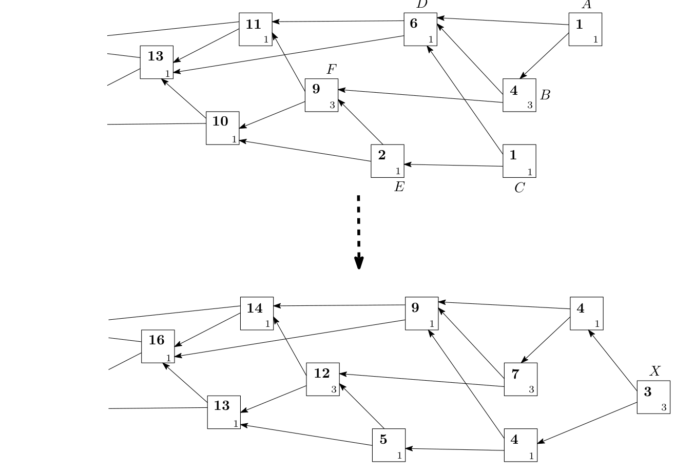
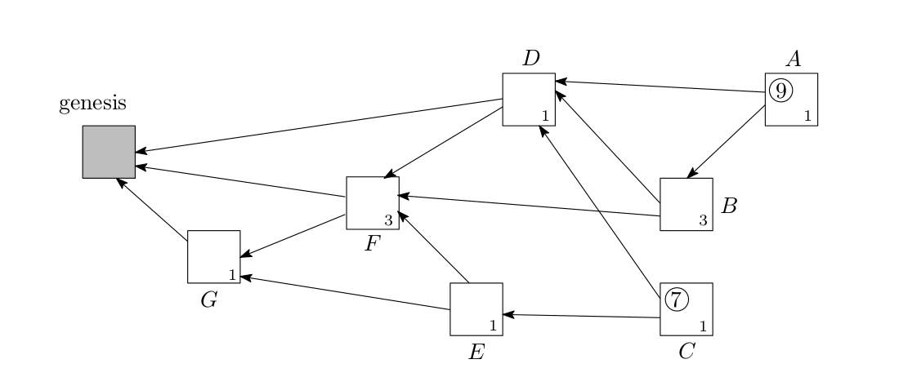

# weight of a block and related concepts
Here, we define the (own) weight of a block and related concepts. The weight
of a block is proportional to the amount of work that the issuing node invested
into it; in practice, the weight may assume only values 3 n , where n is positive integer
and belongs to some nonempty interval of acceptable values.
## cumulative weight
One of the notions we need is the cumulative weight of a block: it is defined
as the own weight of this block plus the sum of own weights of all blocks
that approve our block directly or indirectly. This algorithm of cumulative
weights calculation is illustrated on Figure 1. The boxes represent blocks; the
small numbers in the SE corner stand for the own weights of the blocks, while
the (bigger) bold numbers are the cumulative weights. For example, the block F
is approved, directly or indirectly, by the blocks A, B, C, E. The cumulative
weight of F is 9 = 3 + 1 + 3 + 1 + 1, the sum of the weight of F and the weights of
A, B, C, E.
On the top picture, the only unapproved blocks (the “tips”) are A and C.
When the new block X comes and approves A and C, it becomes the only tip;
the cumulative weight of all other blocks increases by 3 (which is the weight
of X).

在这里，我们定义块的（自）权和相关概念。一块重量是发行节点投入它的工作量成正比；在实践中，体重可能只承担价值3 n，其中n是正整数，属于可接受的值的一些空的间隔。# #累积量我们需要的概念是一个块的累积重量：它被定义为自己的体重这一块加上所有块批准我们的块直接或间接的权重的总和。该累积权重计算算法如图1所示。方框代表块；se角中的小数代表块的自身权重，而（较大的）粗体数字则是累积权重。例如，块F批准，直接或间接地，通过块，B，C，E，F的累积量为9 = 3 + 1 + 3 + 1 + 1，F的重量和A，B，C的权重的总和，如上面的图片，唯一批准的区块（“提示”）是一个和C.在新的块X会批准A和C，它成为唯一的提示；3所有其他块的增加累积的重量（这是X的重量）。

 

Figure 1: On the weights (re)calculation

图1：关于权重（re）计算

 
 
Figure 2: On the calculation of scores (circled)

For the discussion of approval algorithms, we need also to introduce some other
variables. First, for a site (i.e., a block) of the tangle, 
we introduce its
## height, 
as the length of the longest oriented path to the genesis;
## depth, 
as the length of the longest reverse-oriented path to some tip.
For example, on Figure 2, G has height 1 and depth 3 (because of the reverse path
F, B, A), while D has height 2 and depth 2. Also, let us introduce the notion of the
score. 
##score,  
By definition, the score of a block is sum of own weights of all blocks
approved by this block plus the own weight of the block See Figure 2.
Again, the only tips are A and C. Block A approves (directly or indirectly)
blocks B, D, F, G, so the score of A is 1 + 3 + 1 + 3 + 1 = 9. Analogously, the
score of C is 1 + 1 + 1 + 3 + 1 = 7.
Also, let us observe that, among the above metrics, the cumulative weight is the
most important for us (although heights, depths, and scores will briefly enter to some
discussions as well).

对于审批算法的讨论，我们还需要引入一些其他变量。首先，一个网站（即一块）的纠结，我们介绍它的# #高度，对成因的最长路径的长度；# #深度，对于一些尖端的长逆向路径长度。例如，在图2中，g具有高度1和深度3（因为反向路径f、b、a），而d具有高度2和深度2。另外，让我们介绍分数的概念。# #评分，

根据定义，一个块的得分等于该块所允许的所有块的自身重量加上块本身的重量，见图2。同样，唯一的提示是A和C. Block A（直接或间接）块B，D，F，G，所以A的分数是1 + 3 + 1 + 3 + 1 = 9。类似地，C的得分是1 + 1 + 1 + 3 + 1 = 7。另外，让我们观察到，在上述度量中，累积权重对我们来说是最重要的（尽管高度、深度和分数也会简单地进入一些讨论中）。

## tip selection and confidence
It is important to observe that, in general, we have an asynchronous network, so that
nodes do not necessarily see the same set of Blocks. It should be noted also that
the tangle may contain conflicting Blocks. The nodes do not have to achieve
consensus on which valid 4 Blocks have the right to be in the ledger (all of them
can be there); but, in case there are conflicting Blocks, they need to decide
which Blocks will become orphaned (that is, eventually not indirectly approved
by incoming Blocks anymore). The main rule that the nodes use for deciding
between two conflicting Blocks is the following: a node runs the tip selection
algorithm 5 (cf. Section 4.1) many times, and see which Block of the two is more
likely to be (indirectly) approved by the selected tip. For example, if, after 100 runs
of the tip selection algorithm, a Block was selected 97 times, we say that it is
confirmed with 97% confidence.

## MCMC (Markov Chain Monte Carlo) algorithm 
MCMC (Markov Chain Monte Carlo) algorithm to select the two tips to reference.
Let H x be the current cumulative weight of a site (i.e., a block represented
on the tangle graph). Recall that we assumed that all own weights are equal to 1; so,
the cumulative weight of a tip is always 1, and the cumulative weight of other sites
is at least 2.
The idea is to place some particles (a.k.a. random walkers) on sites of the tangle,
and let them walk towards the tips in a random way. The tips “chosen” by the walks
are then the candidates for approval. The algorithm is described in the following way:
1. consider all transactions with cumulative weight between W and (say) 2W
(where W is reasonably large, to be chosen 13 );
2. place N particles independently there (N is not so big, say, 10 or so 14 );
3. these particles will perform independent discrete-time random walks “towards
the tips” (i.e., transition from x to y is possible if and only if y approves x);
4. the two random walks that reach the tip set first will indicate our two tips to
approve;
